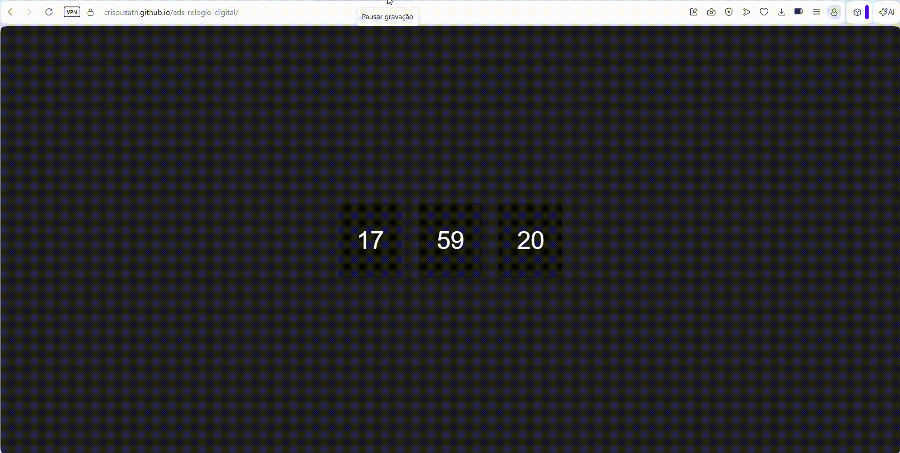

# ⏰ Relógio Digital



## 📖 Sobre o Projeto

Este projeto consiste em um **Relógio Digital** desenvolvido utilizando **HTML, CSS e JavaScript**, capaz de exibir em tempo real as horas, minutos e segundos diretamente na tela.

A aplicação utiliza funções nativas do JavaScript para obter a data e hora atuais do sistema, atualizando automaticamente o relógio a cada segundo.

O projeto foi desenvolvido como atividade prática do curso de **Análise e Desenvolvimento de Sistemas (ADS)** da **Faculdade Flamingo**, com base nas orientações apresentadas pelo professor durante a aula.

---

## 🚀 Tecnologias Utilizadas

- HTML5
- CSS3
- JavaScript

---

## ⚙️ Funcionalidades

- Exibição da hora atual em tempo real.
- Atualização automática dos segundos.
- Interface simples e responsiva.
- Manipulação do DOM utilizando JavaScript.

---

## 🧠 Conceitos Praticados

Durante o desenvolvimento deste projeto foram aplicados conceitos como:

- Estruturação de páginas com HTML.
- Estilização utilizando CSS.
- Manipulação de elementos da página com JavaScript.
- Uso do objeto `Date`.
- Atualização dinâmica de conteúdo.
- Utilização da função `setInterval()`, `getHours()`, `getMinutes()` e `getSeconds()` para consultar o horário atual.

---

## 🎓 Projeto Acadêmico

Este projeto foi desenvolvido como atividade acadêmica para o curso de **Análise e Desenvolvimento de Sistemas (ADS)** da **Faculdade Flamingo**.

A implementação foi realizada com base na explicação apresentada pelo professor durante a aula, disponível no vídeo abaixo:

📺 Vídeo de referência:  
https://www.youtube.com/watch?v=Ni2ste-Nr2M

---

## 📂 Estrutura do Projeto

```text
📁 relogio-digital
│
├── index.html
├── style.css
├── script.js
└── README.md
